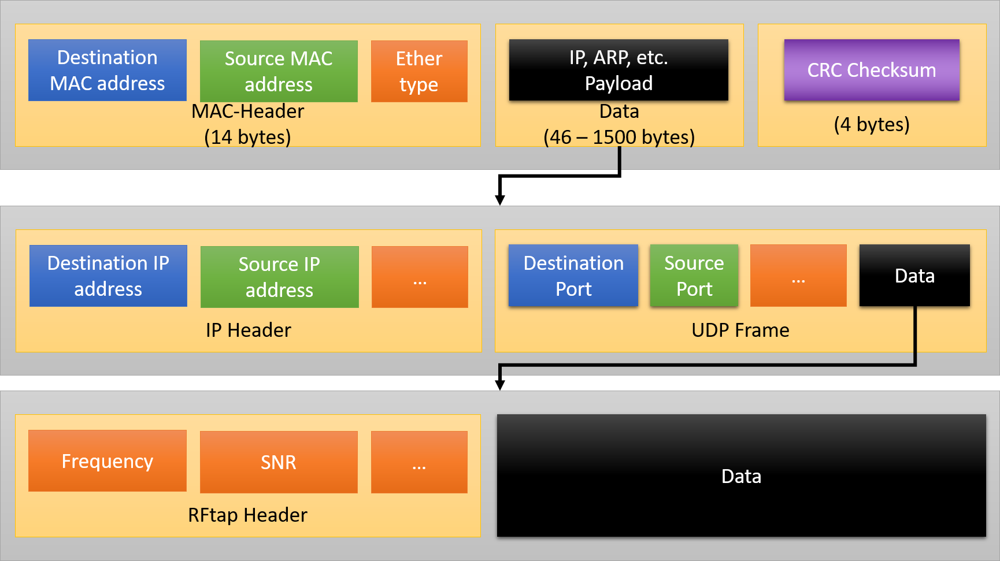

# 2. Umsetzung

Im Rahmen des Projekts wurden die zwei grundsätzlichen Funktionen umgesetzt, die zur Nutzung der Hardware für weitere Experimente erforderlich sind. Dies ist einerseits die Erweiterung des 802.11-Reference-Designs auf den 802.11p-Standard und andererseits die Implementierung einer Ethernet-Schnittstelle zum Empfang und Senden von Daten über einen angeschlossenen Computer. Auf beide Funktionen soll im Folgenden kurz eingegangen werden.

## 2.1. WARP Reference Design für 802.11p

Auf die grundsätzliche Funktionsweise von *802.11p* wurde bereits in **TODO: Referenz 802.11p** eingegangen. Dabei wurde deutlich, dass der Standard sehr ähnlich zum bereits implementierten *802.11a* ist (insbesondere die \ac{ofdm}-Waveform) und sich vor allem in zwei wesentlichen Merkmalen, den Channel-Frequenzen und der Channel-Bandbreite unterscheidet.
Es bietet sich daher an, die Implementierung auf Basis des vorhandenen Frameworks vorzunehmen.

### 2.1.1. Channel-Frequenzen

Für das Teilnehmer-Multiplexing in WLAN-Funksystemen werden üblicherweise Channels verwendet, d.h. es können mehrere getrennte Funknetze dadurch unabhängig voneinander existieren, indem sie verschiedene Channels und dadurch verschiedene Frequenzen für die Kommunikation nutzen.
Im 802.11p Standard sind acht verschiedene Channel-Typen spezifiziert, die für unterschiedliche Aufgaben reserviert sind. {*@tbl:channels} gibt einen Überblick über die spezifizierten Kanäle [@etsi].

| Channel Type | Center frequency                                      | IEEE 802.11 channel number | Channel spacing        | Default data rate               |
|--------------|-------------------------------------------------------|----------------------------|------------------------|---------------------------------|
| G5-CCH       | $\SI{5900}{\mega\hertz}$                              | 180                        | $\SI{10}{\mega\hertz}$ | $\SI{6}{Mbps}$                  |
| G5-SCH2      | $\SI{5890}{\mega\hertz}$                              | 178                        | $\SI{10}{\mega\hertz}$ | $\SI{12}{Mbps}$                 |
| G5-SCH1      | $\SI{5880}{\mega\hertz}$                              | 176                        | $\SI{10}{\mega\hertz}$ | $\SI{6}{Mbps}$                  |
| G5-SCH3      | $\SI{5870}{\mega\hertz}$                              | 174                        | $\SI{10}{\mega\hertz}$ | $\SI{6}{Mbps}$                  |
| G5-SCH4      | $\SI{5860}{\mega\hertz}$                              | 172                        | $\SI{10}{\mega\hertz}$ | $\SI{6}{Mbps}$                  |
| G5-SCH5      | $\SI{5850}{\mega\hertz}$                              | 182                        | $\SI{10}{\mega\hertz}$ | $\SI{6}{Mbps}$                  |
| G5-SCH6      | $\SI{5910}{\mega\hertz}$                              | 184                        | $\SI{10}{\mega\hertz}$ | $\SI{6}{Mbps}$                  |
| G5-SCH7      | nach IEEE 802.11, $\SIrange{5470}{5725}{\mega\hertz}$ | 94 bis 145                 | verschiedene           | abhängig von der Bandbreite     |

Table: 802.11p Channels. {#tbl:channels}

Es wird deutlich, dass eine Erweiterung des verfügbaren Frequenzbandes von 802.11a ($\SIrange{5180}{5825}{\mega\hertz}$) auf 802.11p ($\SIrange{5850}{5925}{\mega\hertz}$) notwendig ist.

Die \ac{rf}-Frequenz wird auf dem Mango WARPv3 Board durch den \ac{rf}-Transceiver MAX2829 (siehe **TODO: Referenz Hardware**) erzeugt.
Dieser kann via \ac{spi} durch die Low-CPU des \ac{fpga} konfiguriert werden [@max2829]. Zur Einstellung der Center-Frequenz des Transceivers sind dabei insbesondere die Register *Band Select and PLL*, *Integer-Divider Ratio* und *Fractional-Divider Ratio* wichtig. Über das *Band Select* Register wird das Frequenzband ($\SI{5}{\giga\hertz}$) ausgewählt und durch den Vorteiler (engl. Divider) wird die Grundfrequenz des Oszillators durch einen rationalen Teiler (Ganzzahl und Fraktion) auf den gewünschten Wert abgeleitet.
Zur Anpassung der verfügbaren Frequenzen ist daher eine Änderung der möglichen Register-Werte des \ac{rf}-Transceivers notwendig.

Im WARP Reference Design erfolgt die Konfiguration des Transceivers durch den radio_controller IP Core. Änderungen der Konfiguration erfolgen also am elegantesten im Treiber des Peripherals.
Konkret bedeutet dies, dass in der Datei `edk/pcores/radio_controller.c` Änderungen für drei Lookup-Tables `rc_tuningParams_5GHz_freqs`, `rc_tuningParams_5GHz_reg3` und `rc_tuningParams_5GHz_reg4` notwendig sind, nämlich müssen die Register-Werte für die hinzugefügten Channels hinterlegt werden.
Die Berechnung der Werte kann händisch nach [@max2829] oder durch das beiligende Python-Skript erfolgen.

Anschließend müssen die zusätzlichen Kanäle zur Verwendung "freigeschalten" werden. Dies erfolgt in der Software der Low-CPU.

### 2.1.2. Channel Bandbreite
Die verwendete Bandbreite des Kanals hängt direkt von der gewählten Sampling-Rate des verwendeten \ac{adc}/\ac{dac}-Wandlers AD9963 ab.
Dieser ist ebenfalls über die \ac{spi}-Schnittstelle durch die Low-CPU konfigurierbar, die Implementierung erfolgt über den w3_ad_controller Core.

Für 802.11p werden vorrangig Kanäle der Bandbreite $\SI{10}{\mega\hertz}$ verwendet. Diese Bandbreite ist bereits im 802.11 Reference Design implementiert, muss jedoch in der Software der Low-CPU durch einen Aufruf der Funktion `set_phy_samp_rate()` aktiviert werden. Der $\SI{10}{\mega\hertz}$-Modus wird dabei durch die Konstante `PHY_10M` ausgewählt.

Im 802.11p Reference Design wird ist dies im *wlan_mac_low_11p*-Projekt implementiert.

## 2.2. Ethernet-Schnittstelle
Für das Projekt wurde beschlossen, dass die Umsetzung von Funktionalität möglichst auf einem normalen Computer erfolgen soll. Die Gründe dafür sind, dass dort bereits eine Vielzahl von spezialisierten Tools (u.a. Wireshark und PCAP) vorhanden sind, deren Implementierung den Rahmen des Projekts bei weitem sprengen würde. Zusätzlich ermöglicht wird es dadurch einfacher ermöglicht, Fehler in der Software zu debuggen und 3rd-party Komponenten (wie beispielsweise MATLAB) anzubinden.

Die Realisierung dieser Design-Ziele erfolgt durch die Instrumentierung des WARP v3 Board über eome Ethernet-Schnittstelle. Darüber können sowohl Daten des WLAN-Kanals empfangen und an einen Computer weitergeleitet, als auch Daten von einem normalen Rechner als 802.11p Frames gesendet werden.

### 2.2.1. Hardware
Das WARPv3 Board besitzt zwei $\SI{1}{Gbps}$-Ethernet-Interfaces. Dabei ist Interface **B** durch das Reference-Design reserviert, um darüber Experimente steuern zu können[@warp-exp]. Die Schnittstelle zur Datenübertragung wurde deshalb auf Interface **A** realisiert. Diese kann über ein normales RJ45 Ethernet-Kabel mit einem beliebigen Rechner verbunden werden.

### 2.2.2. RFtap
Die Übertragung der WLAN-Frames über eine Ethernet-Schnittstelle ist nur möglich, wenn diese vorher in ein entsprechendes Transport-Protokoll verpackt werden. Dies ist dem Umstand geschuldet, dass 802.11-Frames keine gültigen Ethernet(-II)-Frames sind und umgekehrt. Würde das WARP-Board die empfangenen 802.11 Frames vollständig identisch auf die Ethernet-Schnittstelle übertragen, werden die Frames von der Netzwerkkarte des angeschlossenen Rechners verworfen und erreichen dessen Betriebssystem bzw. Anwendungen erst gar nicht.

Es wurden zwei verschiedene Protokolle zur Übertragung von 802.11 Frames über die Ethernet-Schnittstelle evaluiert:
- radiotap, das spezialisiert ist auf "[...] 802.11 frame injection and reception"[@radiotap]
- RFtap, ein Protokoll "[...] designed to provide Radio Frequency (RF) metadata about packets"[@rftap]

Für beide Protokolle existiert eine gute Unterstützung in bestehenden Netzwerk-Analyse Tools wie Wireshark. Im Rahmen des Projekts wurde das *RFtap* Protokoll in die High-CPU Software implementiert. Die Gründe dafür sind die einfachere Implementierung gegenüber radiotap und die erweiterte Funktionalität. Da ein RFtap-Frame verschiedenste Payload-Pakete verpacken kann, ist es unter anderem auch möglich, damit radiotap-Frames zu übertragen.
RFtap kann folglich als Obermenge von radiotap angesehen werden. Zusätzlich ist es mit RFtap Möglich, die empfangenen Pakete um weitere Informationen (insbesondere physikalische Parameter) zu annotieren. +@fig:rftap zeigt schematisch den Aufbau eines RFtap-Frames.

{#fig:rftap}

Für die direkte Verbindung zwischen dem WARPv3 Board und einem Computer sind die verwendeten MAC- und IP-Adressen unkritisch, da auf den Interfaces in diesem Fall keine Filterung stattfindet. In der derzeitigen Implementierung sind die Felder daher leer (Wert 0). Für künftige Projekte wäre es denkbar, diese Informationen sinnvoll zu befüllen. Dies ermöglicht beispielsweise ein Routing von RFtap-Frames über gewöhnliche, kommerzielle Netzwerk-Hardware.

In Wireshark sind RFtap-Dissectors für UDP-Frames auf Destination-Port **52001** implementiert. Erkannt werden die Frames durch die Magic Numbers `0x52 0x46 0x74 0x61` (ascii: RFta) zu Beginn des Frames. Es folgt die Länge (unsigned integer, 2 Byte) des RFtap-Headers (ohne Datenteil!) in 32-bit Words und ein Flags-Bitfield (2 Byte), das die nachfolgenden Header-Flags spezifiziert[@rftap-specifications]. Dabei können (aufgrund des Längenfelds) beliebige zusätzliche Felder an das Ende des Headers angefügt werden, die dann jedoch nicht durch einen Dissector abgedeckt werden können. Der RFtap-Frame endet mit dem RF-Payload. Besonders interessant ist die Angabe des \ac{dlt}-Felds, da dadurch der Typ der Nutzdaten spezifiziert wird. Bei korrekter Angabe nutzt Wireshark dann automatisch den richtigen Dissector um die Payload zu analysieren (beispielsweise LINKTYPE_IEEE802_11, IEEE 802.11 wireless LAN Frame [@tcpdump]).

Das Senden von Frames von einem Rechner erfolgt analog, in umgekehrter Reihenfolge.

